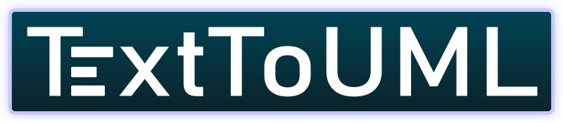
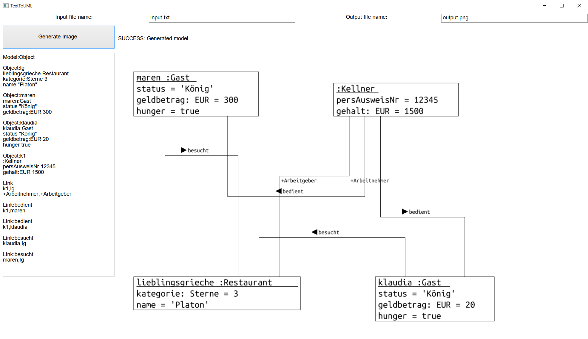
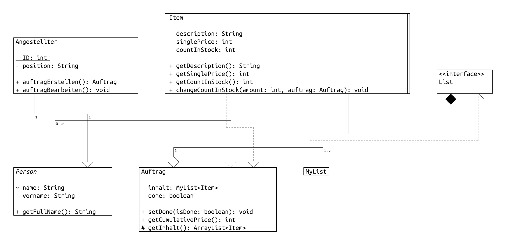
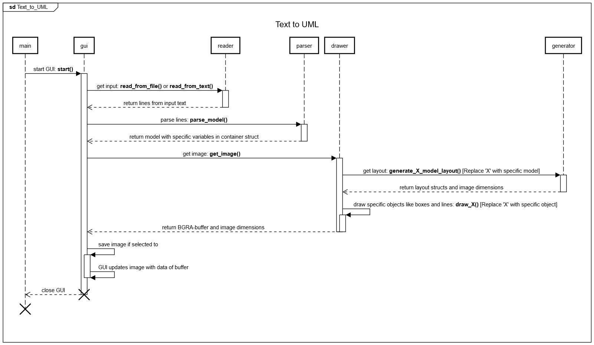

  

# Inhaltsverzeichnis
1. [Aufgabenstellung](#aufgabenstellung)  
1. [Funktionsweise](#funktionsweise)  
1. [Syntax Spezifikation](#syntax-spezifikation)  
   1. [Klassen](#klassen)  
   1. [Relationen](#relationen)  
   1. [Testbeispiel 1](#testbeispiel-1) 
   1. [Objekte](#objekte)  
   1. [Links](#links)  
   1. [Testbeispiel 2](#testbeispiel-2) 
1. [Ablauf und Funktionen](#ablauf-und-funktionen)  

# Aufgabenstellung
Programmieren Sie mit der Programmiersprache Rust (https://www.rust-lang.org/) gemäß Vorgaben des Dozenten eine Software zur Visualisierung von textuell spezifizierten UML-Diagrammen.
Teamgröße: 2 Studierende.
Besprechung des aktuellen Stands und Klären von Fragen im wöchentlichen Praktikum.
1. Abgabe der Software im Praktikum in der 48. Woche 2018 (26. – 30.11.2018).
2. Abgabe der Software im Praktikum in der 4. Woche 2019 (21. - 27.01.2019).

Ideen:
Ähnliche textuelle Spezifizierung wie das Programm UMLet:
  
  

# Funktionsweise
**Text_to_uml** ist ein Programm zur textuellen Spezifikation von UML-Klassendiagrammen, aus der ein Bild generiert werden kann.

Das Programm besteht aus mehreren Teilen: *GUI*, *Parser*, *Reader*, *Generator* und *Drawer*. Über die *GUI* kann ein Text per Eingabefeld oder per Datei mithilfe des *Readers* eingelesen werden. Der *Parser* liest die textuelle Spezifikation und wandelt sie zu einer definierten Schnittstelle um, die der *Drawer* und der *Generator* nutzen können. Der *Drawer* zeichnet das Diagramm anhand der Anordnungen des *Generators*, welcher automatisch berechnet, wie z.B. Klassen und Relationen positioniert werden sollen, und gibt die Bilddaten und -informationen zurück zur *GUI*. Diese stellt das UML-konforme Diagramm dar und kann es, wenn gewünscht, auch speichern.  
Zum tieferen Verständnis siehe passendes [Sequenzdiagramm](#ablauf-und-funktionen).

Screenshot des Programms:  

Zu beachten:  
- Als Pfad für z.B. die Textdatei der textuellen Spezifikation wird dasselbe Verzeichnis als Root genutzt, in der das Programm liegt.
- Wird kein Output-Pfad angegeben, wird das Bild generiert und angezeigt, jedoch nicht gespeichert.
- Wird ein Input-Pfad und ein Text direkt im Textfeld angegeben, wird das Textfeld bevorzugt.

# Syntax Spezifikation
Die Syntax, also wie Sprachen geschrieben werden, ist simpel gehalten worden, damit sie leicht verständlich und von jedem schnell umgesetzt werden kann. Sie ähnelt sich bei den verschiedenen Diagrammtypen.  

**Optionalitäten sind durch "[]" gekennzeichnet, Pflichtfelder durch "\<\>". Jedes weitere Zeichen (wie Kommata) gehören fest zur Syntax.**  
  
  
Vor jedem Diagramminhalt muss der Typ festgelegt werden.  

Zuerst schreibt man also: **Model:\<Typ\>**  

Dabei sind folgende Optionen zurzeit für den Parameter verfügbar:  
  
`<Typ>` - Der Diagrammtyp
- `Class` = [Klassendiagramm](#klassendiagramm)
- `Object` = [Objektdiagramm](#objektdiagramm)

## Klassendiagramm
In einem Klassendiagramm gibt es zwei grundlegende Elemente: Klassen und Relationen. Jedes Element wird mit einer Leerzeile von anderen Elementen getrennt.  
  
  
### Klassen
Die Musterdefinition einer Klasse sieht wie folgt aus:

**\<KlassenTyp\>,\<KlassenName\>
[\<\<stereotyp\>\>]
[Inhalt...]**

Dabei stehen die Parameter für:

`<KlassenTyp>` - Der Typ der Klasse. Mögliche Typen sind:
- `Class`
- `AbstractClass`
- `ActiveClass`

`<KlassenName>` - Der Name der Klasse. Dieser wird in den Relationen weiterverwendet.

`[<<stereotyp>>]` - Der Stereotyp der Klasse. Muss von "<<>>" umschlossen sein.
Es existieren auch spezielle Stereotypen. Wählt man zum Beispiel als KlassenTyp "Class" und als Stereotyp "\<\<abstract\>\>" so erhält man eine "AbstractClass".

`[Inhalt...]` - Der Inhalt der Klasse. Dabei wird jede Zeile nochmal selber formatiert:
- Schlüsselwörter werden umgewandelt:
    - `public` -> +
    - `package` -> ~
    - `protected` -> #
    - `private` -> -
- static entfernt, die gesamt Zeile wird unterstrichen
- Datentypen werden an das Ende der Zeile geschrieben, getrennt mit einem Doppelpunkt
- Zwei Bindestrich in einer Zeile alleine erstellen einen horizontalen Strich

Ein Beispiel für eine Zeile:
`public MyObject getReference()` wird zu `+ getReference(): MyObject`

Ein Beispiel für eine ganze Klasse:

    Class:Klasse1
    private String name
    --
    public static void main()
    public String name()

---

### Relationen
Auch Relationen haben eine Musterdefinition:

**\<RelationsTyp\>
\<VonKlasse\>,\<ZuKlasse\>
[MultiVon,MultiZu]**

Dabei stehen die Parameter für:

`<RelationsTyp>` - Der Typ der Relation. Mögliche Typen sind:
- `Association`
- `Inheritance`
- `Implementation`
- `Dependency`
- `Aggregation`
- `Composition`

`<VonKlasse>,<ZuKlasse>` - Die *Namen* der Klassen, die verbunden werden sollen. Hier müssen die gleichen Namen verwendet werden, die bei der Klassendefinition auch verwendet wurden.

`[MultiVon,MultiZu]` - Die Multiplizitäten der Relation. `MultiVon` steht dabei an der Relation nahe der Klasse `<VonKlasse>`.

Ein Beispiel für eine ganze Relation:
Es existieren beispielsweise schon die Klassen `Person` und `Angestellter`.

    Inheritance
    Angestellter,Person
    1,1

---

### Testbeispiel 1
Im Folgenden findet sich ein Beispiel für ein ganzes UML-Klassendiagramm:

    Model:Class
    
    AbstractClass:Person
    --
    private String name
    private String vorname
    --
    public String getFullName()

    Class:Angestellter
    --
    private static int ID
    private String position
    --
    public Auftrag auftragErstellen()
    public void auftragBearbeiten()

    Class:Auftrag
    --
    private MyList<Item> inhalt
    private boolean done
    --
    public void setDone(boolean isDone)
    public int getCumulativePrice()
    public ArrayList<Item> getInhalt()

    Class:Item
    --
    private String description
    private int singlePrice
    private int countInStock
    --
    public String getDescription()
    public int getSinglePrice()
    public int getCountInStock()
    public void changeCountInStock(int amount)

    Class:MyList
    
    Class:List
    <<interface>>

    Inheritance
    Angestellter,Person
    1,1

    Association
    Angestellter,Auftrag
    0..n,1

    Aggregation
    Item,Auftrag
    1,1..n

    Implementation
    MyList,List

    Association
    Auftrag,MyList

Welches zu folgendem Bild führt:  

  

## Objektdiagramm
In einem Ojektdiagramm gibt es zwei grundlegende Elemente: Objekte und Links. Jedes Element wird mit einer Leerzeile von anderen Elementen getrennt.  

### Objekte
Die Musterdefinition eines Objekts sieht wie folgt aus:

**Object:\<InternerObjektName\>  
[\<AnzeigeObjektName\>]:\<KlasseDesObjekts\>  
[Inhalt...]**  

Dabei stehen die Parameter für:

`<InternerObjektName>` - Ein Name, der wie eine id für das Objekt wirkt. Dies ist nötig, da Objekte ohne Namen instantiiert weden können und die Links eine Referenz auf ihre Objekte benötigen. 

`[<AnzeigeObjektName>]` - Der Name des Objekts. Dieser wird in den Links *nicht* weiterverwendet. Er ist optional.

`<KlasseDesObjekts>` - Der Typ des Objekts bzw. deren Klasse. Dies hat nichts mit dem Klassendiagramm zu tun und kann ein beliebeiger String sein.

`[Inhalt...]` - Der Inhalt des Objekts. Dabei wird jede Zeile nochmal aufgeteilt in:

**\<AttributName\>[:\<AttributTyp\>] \<AttributInhalt\>**

`<AttributName>` - Der Name des Attributs.

`[:<AttributTyp>]` - Der Datentyp des Attributs. Er kann explizit angegeben werden.

`<AttributInhalt>` - Die dem Attribut zugewiesenen Daten.

Ein Beispiel für eine Zeile:
`gehalt:EUR 1500` wird zu `gehalt: EUR = 1500`

Ein Beispiel für ein ganzes Objekt:

    Object:lg
    lieblingsgrieche:Restaurant
    kategorie:Sterne 3
    name "Platon"

---

### Links
Auch Links haben eine Musterdefinition:

**Link[:\<LinkName\>]
\<VonObjekt\>,\<ZuObjekt\>
[RolleVon,RolleZu]**

Dabei stehen die Parameter für:

`[:<LinkName>]` - Der Name des Links. Er wird mit einem Richtungspfeil auf die Mitte des Links geschrieben und sollte ein Verb sein.

`<VonObjekt>,<ZuObjekt>` - Die *internen Namen* der Objekte, die verbunden werden sollen. Hier müssen die gleichen internen Namen verwendet werden, die bei der Objektdefinition auch verwendet wurden.

`[RolleVon,RolleZu]` - Die Rollen zwischen den Objekten auf dem Link. `RolleVon` steht dabei an dem Link nahe des Objekts `<VonObjekt>`. Anstatt einer Rolle kann natürlich auch eine Multiplizität genutzt werden.

Zwei Beispiele für ganze Links:
Es existieren beispielsweise schon die Objekte "Maren" mit dem internen Namen `maren`, "lieblingsgrieche" mit `lg` und ein Kellner ohne Namen mit `k1`.

    Link
    k1,lg
    +Arbeitnehmer,+Arbeitgeber

    Link:bedient
    k1,maren

---

### Testbeispiel 2
Im Folgenden findet sich ein Beispiel für ein ganzes UML-Objektdiagramm:

    Model:Object
    
    Object:lg
    lieblingsgrieche:Restaurant
    kategorie:Sterne 3
    name "Platon"
    
    Object:maren
    maren:Gast
    status "König"
    geldbetrag:EUR 300
    
    Object:klaudia
    klaudia:Gast
    status "König"
    geldbetrag:EUR 20
    hunger true
    
    Object:k1
    :Kellner
    persAusweisNr 12345
    gehalt:EUR 1500
    
    Link
    k1,lg
    +Arbeitnehmer,+Arbeitgeber
    
    Link:bedient
    k1,maren
    
    Link:bedient
    k1,klaudia
    
    Link:besucht
    klaudia,lg
    
    Link:besucht
    maren,lg

Welches zu folgendem Bild führt:  

# Ablauf und Funktionen
Im folgenden wird ein Sequenzdiagramm für "TextToUML" abgebildet. Anstatt Objekte werden Klassen genutzt, weswegen die Lebenszeit hier nicht zu ernst genommen werden soll, da die Stränge nur zur Übersicht bzw. Verständnis dienen.

