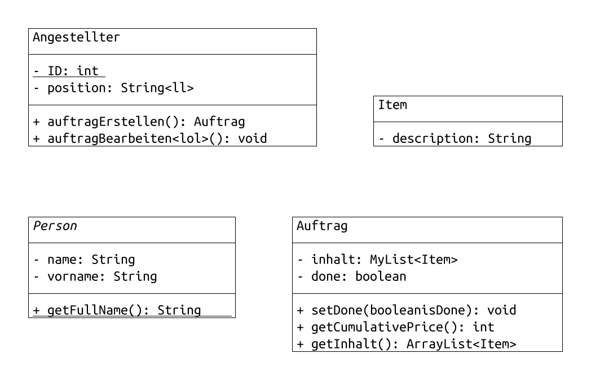

# TextToUML
Programmieren Sie mit der Programmiersprache Rust (https://www.rust-lang.org/) gemäß Vorgaben des Dozenten eine Software zur Visualisierung von textuell spezifizierten UML-Diagrammen.
Teamgröße: 2 Studierende.
Besprechung des aktuellen Stands und Klären von Fragen im wöchentlichen Praktikum.
Abgabe der Software im Praktikum in der 48. Woche (26. – 30.11.2018).

Ideen:
Ähnliche textuelle Spezifizierung wie das Programm UMLet:
  
  
Beispiel Output:  

# Funktionsweise
**Text_to_uml** ist ein Programm zur textuellen Spezifikation von UML-Klassendiagrammen, aus der ein Bild generiert werden kann.

Das Programm besteht aus zwei Teilen: Parser und Layout-Manager. Der Parser ist dafür da, die textuelle Spezifikation einzulesen und zu einer definierten Schnittstelle umzuwandeln, die der Layout-Manager dann übernehmen und auf ein Bild bringen kann.
Die textuelle Spezifikation wird in einer Textdatei geschrieben, die im selben Verzeichnis liegt, wie das Programm. Anschließend wird das Programm über die command-line gestartet, dabei kann der Name der einzulesenden Datei als Parameter angegeben werden. Wird der Name nicht angegeben, sucht das Programm nach einer "input.txt" Datei. Wird diese nicht gefunden, beendet sich das Programm wieder.

Wurde die Datei gefunden, geht der Parser zeilenweise über die Datei und liest die Syntax ein, dazu unten mehr.
Der Layout-Manager berechnet im Anschluss automatisch die Positionen der Klassen und Relationen auf dem Output-Bild und kümmert sich um das korrekte Aussehen der Inhalte. Dabei werden Formate wie static, abstract (usw.) entsprechend der UML-Definition formatiert, Seperatoren eingefügt und Relationen mit Multiplizitäten beschriftet.
Zuletzt gibt das Programm das Bild als "output.png" aus.

# Syntax Spezifikation
In einem Klassendiagramm gibt es zwei grundlegende Elemente: Klassen und Relationen. Jedes Element wird mit einer Leerzeile von anderen Elementen getrennt.  
Optionalitäten sind durch "[]" gekennzeichnet, Pflichtfelder durch "\<\>". Jedes weitere Zeichen (wie Kommata) gehören fest zur Syntax.

## Klassen
Die Musterdefinition einer Klasse sieht wie folgt aus:

**\<KlassenTyp\>,\<KlassenName\>
[\<\<stereotyp\>\>]
[Inhalt...]**

Dabei stehen die Parameter für:

`<KlassenTyp>` - Der Typ der Klasse. Mögliche Typen sind:
- Class
- AbstractClass
- ActiveClass

`<KlassenName>` - Der Name der Klasse, dieser wird in den Relationen weiterverwendet

`[<<stereotyp>>]` - Der Stereotyp der Klasse. Muss von "<<>>" umschlossen sein.
Es existieren auch spezielle Stereotypen. Wählt man zum Beispiel als KlassenTyp "Class" und als Stereotyp "\<\<abstract\>\>" so erhält man eine "AbstractClass".

`[Inhalt...]` - Der Inhalt der Klasse. Dabei wird jede Zeile nochmal selber formatiert:
- Schlüsselwörter werden umgewandelt:
    - public -> +
    - package -> ~
    - protected -> #
    - private -> -
- static entfernt, die gesamt Zeile wird unterstrichen
- Datentypen werden an das Ende der Zeile geschrieben, getrennt mit einem Doppelpunkt
- Zwei Bindestrich in einer Zeile alleine erstellen einen horizontalen Strich

Ein Beispiel für eine Zeile:
`public MyObject getReference()` wird zu `+ getReference(): MyObject`

Ein Beispiel für eine ganze Klasse:

    Class:Klasse1
    private String name
    --
    public static void main()
    public String name()

## Relationen
Auch Relationen haben eine Musterdefinition:

**\<RelationsTyp\>
\<VonKlasse\>,\<ZuKlasse\>
[MultiVon,MultiZu]**

Dabei stehen die Parameter für:

`<RelationsTyp>` - Der Typ der Relation. Mögliche Typen sind:
- Association
- Inheritance
- Implementation
- Dependency
- Aggregation
- Composition

`<VonKlasse>,<ZuKlasse>` - Die *Namen* der Klassen, die verbunden werden sollen. Hier müssen die gleichen Namen verwendet werden, die bei der Klassendefinition auch verwendet wurden.

`[MultiVon,MultiZu]` - Die Multiplizitäten der Relation. `MultiVon` steht dabei an der Relation nahe der Klasse **\<VonKlasse\>**

Ein Beispiel für eine ganze Relation:
Es existieren beispielsweise schon die Klassen `Person` und `Angestellter`

    Inheritance
    Angestellter,Person
    1,1

## Testbeispiel
Im Folgenden findet sich ein Beispiel für ein ganzes UML-Klassendiagramm:

    AbstractClass:Person
    private String name
    private String vorname
    --
    public String getFullName()

    Class:Angestellter
    private static int ID
    private String position
    --
    public Auftrag auftragErstellen()
    public void auftragBearbeiten()

    Class:Auftrag
    private MyList<Item> inhalt
    private boolean done
    --
    public void setDone(boolean isDone)
    public int getCumulativePrice()
    public ArrayList<Item> getInhalt()

    Class:Item
    private String description
    private int singlePrice
    private int countInStock
    --
    public String getDescription()
    public int getSinglePrice()
    public int getCountInStock()
    public void changeCountInStock(int amount)

    Class:MyList
    
    Class:List
    <<interface>>

    Inheritance
    Angestellter,Person
    1,1

    Association
    Angestellter,Auftrag
    0..n,1

    Aggregation
    Item,Auftrag
    1,1..n

    Implementation
    MyList,List

    Association
    Auftrag,MyList
